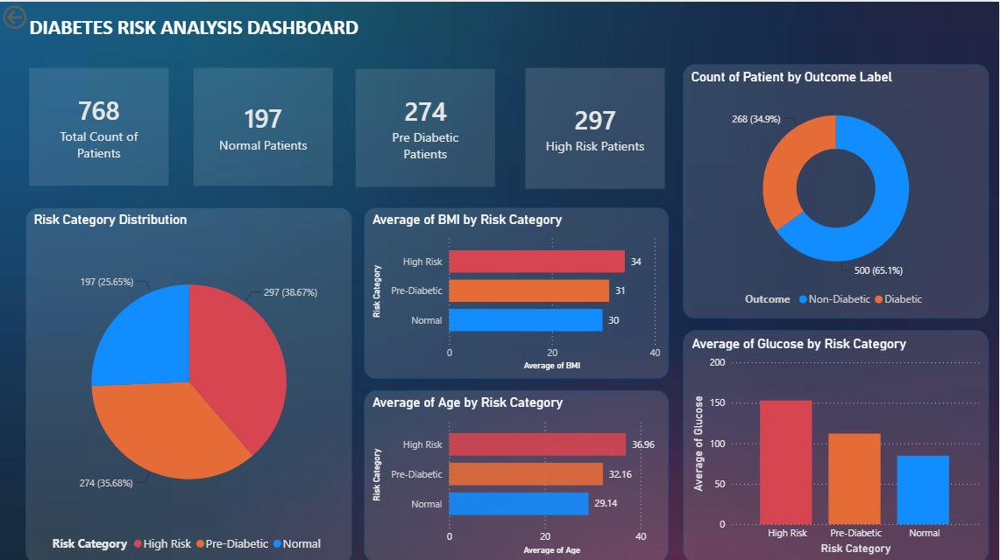

## Dashboard Preview

\# Diabetes Risk Analysis Dashboard

\## Project Overview

This project analyzes diabetes patient data using Python, SQL, and Power BI.

\## Tools Used

* Python (Pandas)
* MySQL
* Power BI

\## Python Tasks

* Data cleaning
* Null value handling
* Duplicate removal
* Feature creation
* Statistical Analysis
* Risk category classification

\## Risk Categories

* Normal (Glucose < 100)
* Pre-Diabetic (100–125)
* High Risk (>=126)

\## SQL Analysis

* Total patient count
* Risk category distribution 
* Average BMI by risk category
* Average age by risk category
* Outcome distribution

\## Power BI Dashboard

Visualizations include:

* KPI Cards
* Risk Category Distribution
* Outcome Distribution
* Average BMI by Risk Category
* Average Age by Risk Category
* Average Glucose by Risk Category

## Dashboard Preview

\## Dataset

Pima Indians Diabetes Dataset

